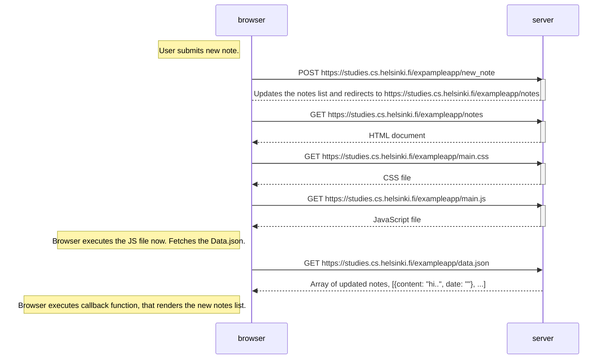

```mermaid
sequenceDiagram
    participant browser
    participant server
    note left of browser: User submits new note.
    browser->>server: POST https://studies.cs.helsinki.fi/expampleapp/new_note
    activate server
    server-->browser: Updates the notes list and redirects to https://studies.cs.helsinki.fi/exampleapp/notes
    deactivate server

    browser->>server: GET https://studies.cs.helsinki.fi/exampleapp/notes
    activate server
    server-->>browser: HTML document
    deactivate server

    browser->>server: GET https://studies.cs.helsinki.fi/exampleapp/main.css
    activate server
    server-->>browser: CSS file
    deactivate server

    browser->>server: GET https://studies.cs.helsinki.fi/exampleapp/main.js
    activate server
    server-->>browser: JavaScript file
    deactivate server
    note left of browser: Browser executes the JS file now. Fetches the Data.json.

    browser->>server: GET https://studies.cs.helsinki.fi/exampleapp/data.json
    server-->>browser: Array of updated notes, [{content: "hi..", date: ""}, ...]
    note left of browser: Browser executes callback function, that renders the new notes list.
```