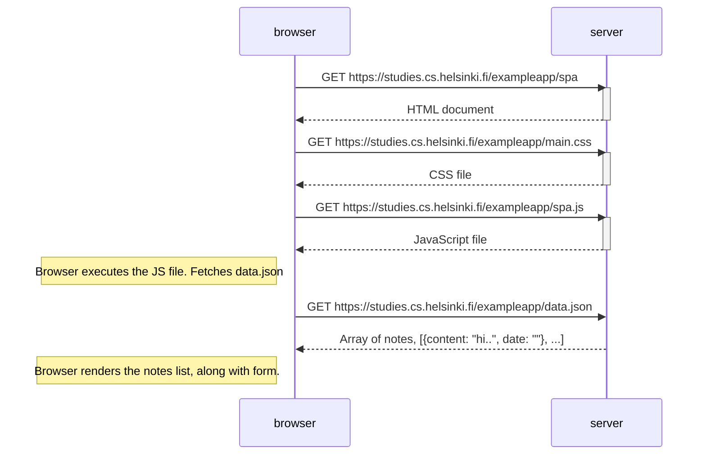

```mermaid
sequenceDiagram
    participant browser
    participant server

    browser->>server: GET https://studies.cs.helsinki.fi/exampleapp/spa
    activate server
    server-->>browser: HTML document
    deactivate server

    browser->>server: GET https://studies.cs.helsinki.fi/exampleapp/main.css
    activate server
    server-->>browser: CSS file
    deactivate server

    browser->>server: GET https://studies.cs.helsinki.fi/exampleapp/spa.js
    activate server
    server-->>browser: JavaScript file
    deactivate server
    note left of browser: Browser executes the JS file. Fetches data.json

    browser->>server: GET https://studies.cs.helsinki.fi/exampleapp/data.json
    server-->>browser: Array of notes, [{content: "hi..", date: ""}, ...]
    note left of browser: Browser renders the notes list, along with form.
```