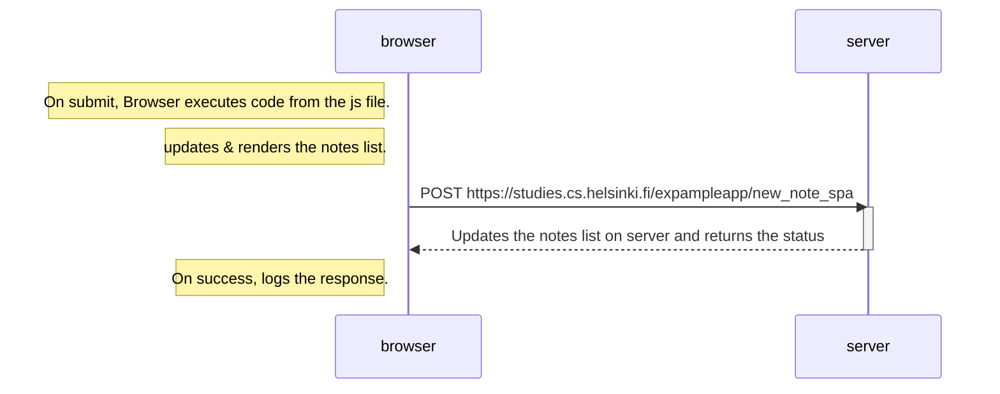

```mermaid
sequenceDiagram
    participant browser
    participant server
    note left of browser: On submit, Browser executes code from the js file.
    note left of browser:  updates & renders the notes list.
    browser->>server: POST https://studies.cs.helsinki.fi/expampleapp/new_note_spa
    activate server
    server-->>browser: Updates the notes list on server and returns the status
    deactivate server

    note left of browser: On success, logs the response.
```